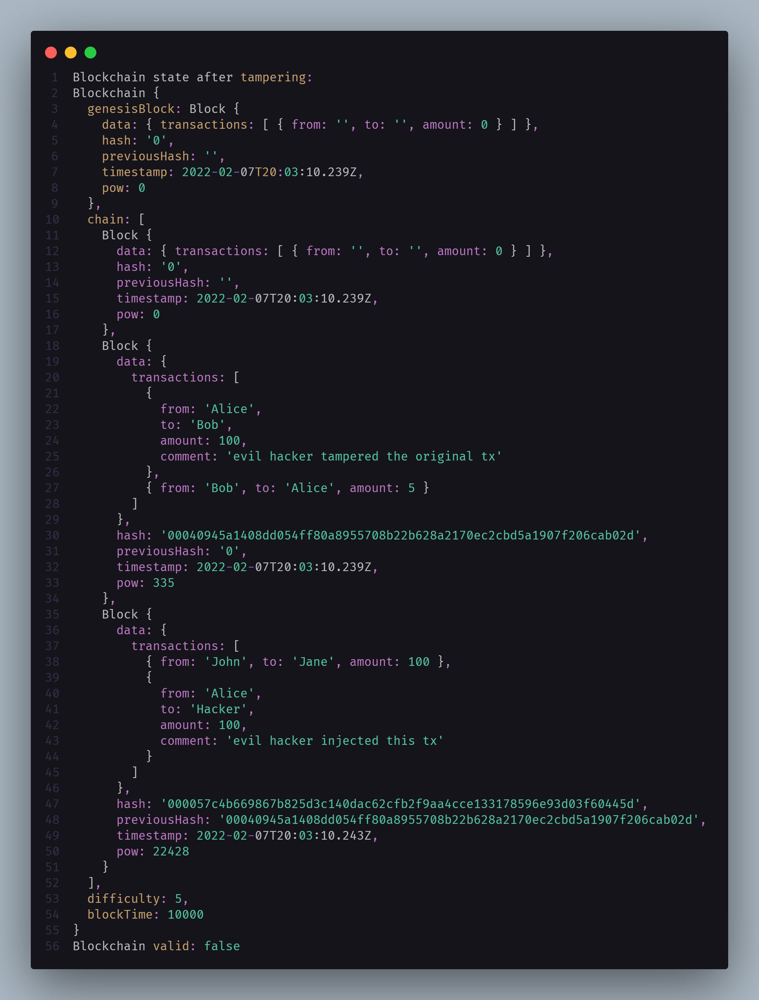

# A simple blockchain implementation in Typescript

It just shows the internals of a [proof-of-work](https://en.wikipedia.org/wiki/Proof_of_work) blockchain in a very simplificated manner.

This is purely for fun and demo purposes. Feel free to do anything you want with it!

## Prerequisites

-   Node.js
-   A code-editor like VScode

## Run Locally

Clone the project

```bash
  git clone https://github.com/nimble-123/ts-blockchain-example.git
```

Go to the project directory

```bash
  cd ts-blockchain-example
```

Install dependencies

```bash
  yarn install
```

Transpile Typescript to JavaScript

```bash
  yarn build:ts
```

Start the demo

```bash
  yarn start
```

You should see a similar output like this



## License

[MIT](https://choosealicense.com/licenses/mit/)
